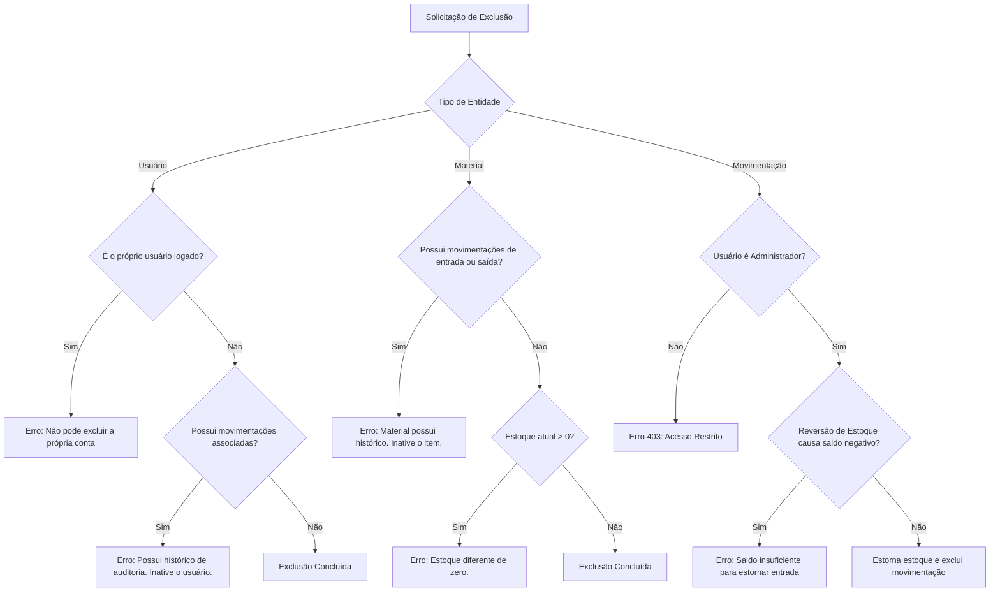

# Data Model: Perfis Únicos e Exclusão Segura com Integridade Relacional

**Feature**: `010-correcao-perfis-permissoes`  
**Date**: 2026-09-04  

---

## 1. Entidades e Relacionamentos

### `User`
- **Tabela**: `users`
- **Campos**: `id`, `name`, `email`, `password`, `status`, `created_at`, `updated_at`
- **Relações**:
  - `roles()`: `MorphToMany(Role)` via `model_has_roles` (regra de negócio: cardinalidade estrita 1:1)
  - `movements()`: `HasMany(Movement)` (impede exclusão se `count > 0`)
- **Novos Métodos/Helpers**:
  - `primary_role`: String com o nome do perfil único (`Administrador`, `Almoxarife` ou `Consulta`)
  - `primary_role_badge`: Classe CSS e ícone Bootstrap correspondentes

### `Material`
- **Tabela**: `materials`
- **Campos**: `id`, `code_sku`, `name`, `category_id`, `unit_measure`, `current_stock`, `minimum_stock`, `status`
- **Relações**:
  - `movementItems()`: `HasMany(MovementItem)`
- **Regra de Exclusão**:
  - Se `movementItems()->exists() == true` $\rightarrow$ Bloqueado
  - Se `current_stock > 0` $\rightarrow$ Bloqueado
  - Se ambas forem falsas $\rightarrow$ Permitido

### `Movement` & `MovementItem`
- **Tabela**: `movements` e `movement_items`
- **Relações**:
  - `items`: `HasMany(MovementItem)`
  - `entryDocument`: `HasOne(EntryDocument)`
- **Regra de Exclusão**:
  - Restrita a usuários com papel `Administrador`
  - Reversão de estoque executada atomicamente por `StockService::deleteMovement($movement)`

---

## 2. Diagrama de Validação de Exclusão

